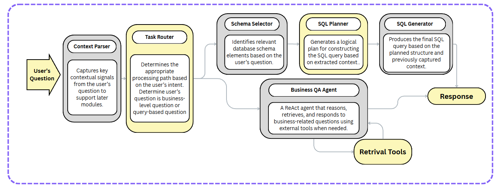

# Multi-Agent Text-to-SQL & Business QA at VDS

> **Goal** – Automate two frequent analytics scenarios at VDS:
>
> 1. **Business-level QA** – answer questions about indicator definitions & calculation logic.
> 2. **Text-to-SQL** – translate natural-language questions into SQL queries that fit the internal schema.

---

## 1 Architecture overview

The pipeline is orchestrated by **LangGraph** and powered by **Gemini Flash 2.0**.  Core agents:

| Step | Agent               | Purpose |
|------|---------------------|---------|
| ①    | **Context Parser**  | Enrich raw question with business context & temporal cues. |
| ②    | **Task Router**     | Route to *business* or *sql* branch. |
| ③    | **Schema Selector** | Filter schema to tables/columns relevant to the question. |
| ④    | **SQL Planner**     | Produce a step-by-step logical plan. |
| ⑤    | **SQL Generator**   | Generate final SQL from the plan. |
| ∥    | **Business QA Agent** | Answer qualitative questions via ReAct + retrieval. |

---

## 2 Key internal results

| Variant     | Business QA | Text-to-SQL |
|-------------|-------------|-------------|
| Single      | 100 %       | 78 %        |
| +Schema     | 100 %       | 90 %        |
| +Planner    | **100 %**   | **98.5 %**  |

Dataset: 60 business questions & 200 question–SQL pairs (single revenue table, 18 columns).

---

## 3 Roadmap

1. Fine-tune an on-premise open-source LLM on internal chat logs.
2. Add a critic agent for automatic validation & guardrails.
3. Enable live SQL execution with latency logging.
4. Expand schema coverage beyond a single revenue table.

---

## 4 Citation

    @misc{vds2025text2sql,
      title   = {A Multi-Agent Framework for Text-to-SQL Generation and Business QA at VDS},
      author  = {Tran Anh Tuan},
      year    = {2025},
      note    = {Internal Technical Report, Viettel Digital Services}
    }

---

© 2025 Viettel Digital Services – internal use only.